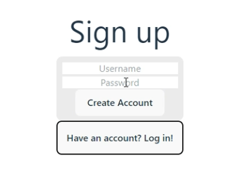
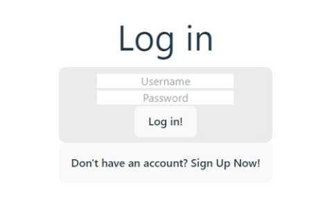
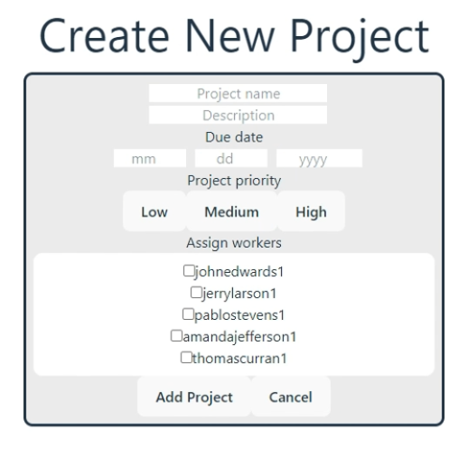
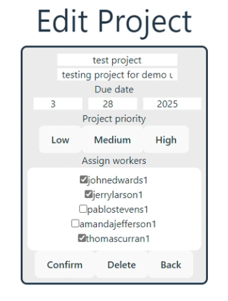
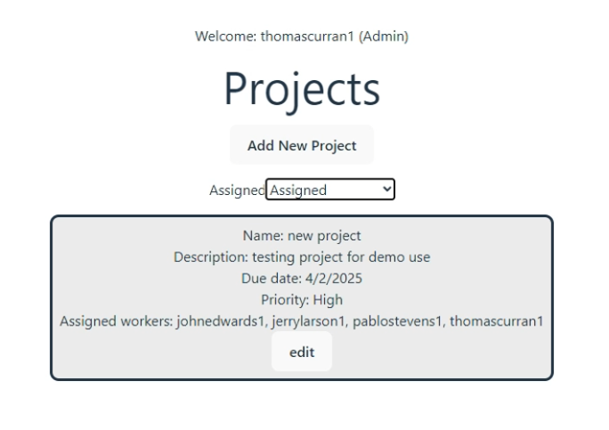
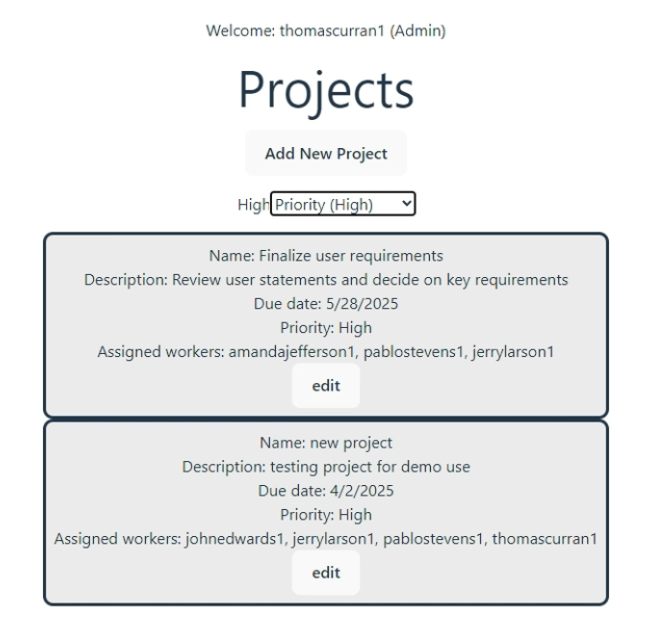
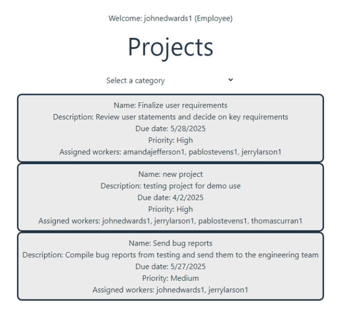
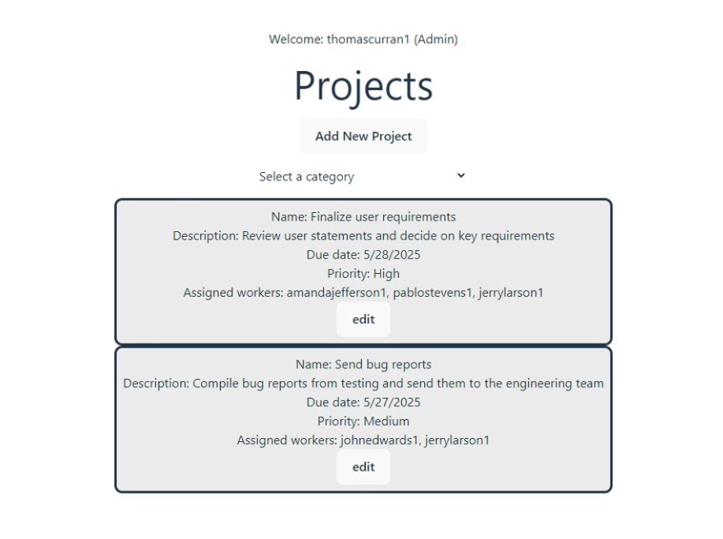

# Full-Stack Project Managment Web App

Full stack project managment web app that allows users to create, update, and delete projects.

## **Description**

This project uses a React frontend (JavaScript, HTML, CSS), Rest Api and Spring Boot backend (Java), and a PostgresSQL database to allow users to create, edit, and delete projects. Users can also create an account and log in, with employee accounts being able to view projects and Admin accounts having permissions to create, edit and delete. Created to replicate other project managment apps like Jira and Trello.

## **Table of Contents**

- [Installation](#installation)
- [Usage](#usage)
- [Features](#features)
- [Reasources](#reasources)
- [Known issues and future development](#known-issues-and-future-development)
- [License](#license)

## **Installation**

To install this project, follow these steps:

1. Clone the repository: **https://github.com/ThomasCurran2/project_management_app.git**
2. Install dependencies
3. In the terminal go to "project_management_app/backend_and_database"
4. Run "docker compose up" to create a docker contianer.

## **Usage**

To use this app, follow these steps:

1. Open the project a code editor.
2. Modify the source code to fit your needs.
3. Open docker and make sure your container is running.
4. Run "ProjectsApplication.java"
5. In the terminal go to "project_management_app/frontend/react-app"
6. Run "npm run dev" and open the link.
7. Create an account on the Sign Up page. (use the password "adminpassword" for admin permissions)
8. Log in with your new account.
9. View, Create, Edit and Delete projects.

Demo Video:

  

## **Features**

1. Sign up and Login page

     
  

2. Creating and editing projects

   
  

3. Project filters

   
  

4. Employee and Admin versions

   
 

## **Reasources**

Here are some helpful links and videos:

- **[`Vite Documentation`](https://vite.dev/)**
- **[`Frontend and backend setup`](https://www.youtube.com/watch?v=-LUA-LHXobE)**

## **Known issues and future development**

Issues:

1. The project wrapper warns that each element needs a key but functions normally.

Future development:

Multi-page functionality and the ability to create more than 10 projects is in development. 

## **License**

Project_Managment_App is released under the MIT License. See the **[MIT licensing page](https://tlo.mit.edu/understand-ip/exploring-mit-open-source-license-comprehensive-guide)** for details.

## **Authors and Acknowledgment**

Created by **[Thomas Curran](https://github.com/ThomasCurran2)**.

## **Changelog**

- **0.1.0:** Initial release
